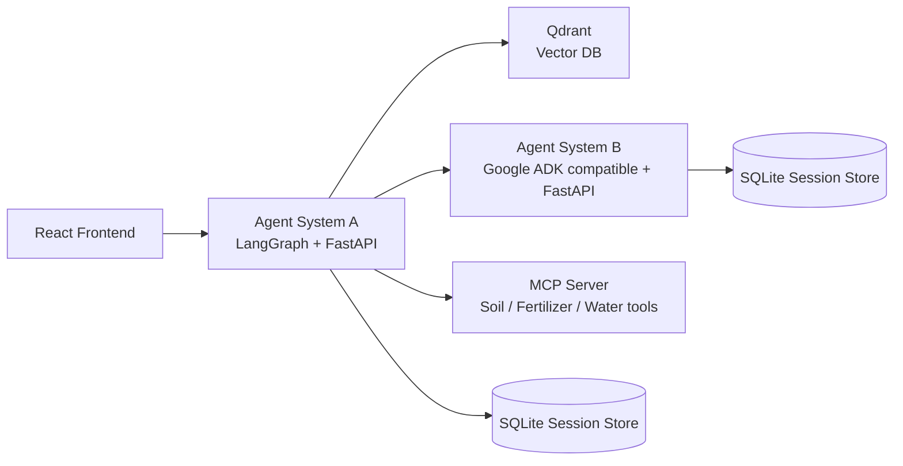

# Smart Agriculture Advisor — Production AI Agent System

A production-style multi-agent agriculture decision-support platform for Lebanese and Mediterranean farming contexts.

It was designed to align directly with the course rubric:
- **Agent System A** uses **LangGraph** as the primary orchestrator.
- **Agent System B** is an **independent secondary service** with its own logic and API.
- A dedicated **MCP server** exposes agriculture tools in its own container.
- **Qdrant** provides the retrieval layer.
- The full system runs through **docker-compose** with separated containers and networks.
- A polished **static frontend** is included for demo quality and presentation value without requiring npm downloads during the build.

The uploaded project idea already commits to a Smart Agriculture Advisor with crop guidance, pest support, irrigation planning, fertilizer support, and market timing. This repository implements that direction. fileciteturn2file0

The rubric also requires two independent systems on different tech stacks, a RAG pipeline, an MCP server, dockerized microservices, FastAPI APIs, guardrails, session persistence, evaluation, and written technical justifications. That is the structure used here. fileciteturn2file1

## 1) Architecture



## 2) Why this design matches the rubric

### Agent System A — LangGraph supervisor
The primary system uses a **supervisor + specialists** pattern because the rubric explicitly values meaningful decomposition, routing quality, and multi-agent architecture. fileciteturn2file6

Specialists:
- **Crop Management Agent**
- **Pest Diagnosis Agent**
- **Market Agent**
- **Irrigation bridge** to Agent System B
- **Soil / fertilizer bridge** to the MCP server

### Agent System B — Independent secondary service
The requirements state that Agent System B must be separate, independently deployed, and called over the network instead of imported into Agent System A. fileciteturn2file11

This project keeps Agent B in:
- its **own folder**
- its **own Dockerfile**
- its **own requirements**
- its **own FastAPI app**
- its **own session persistence**
- its **own HTTP API**

The service is **Google ADK compatible**. The official ADK docs show Python support, installation with `pip install google-adk`, and agent definitions centered around a `root_agent`. citeturn273600search0turn583850view0  
To keep demos robust, a deterministic fallback is also included so the architecture still works even when a Gemini key is not available.

### MCP server
The rubric requires a dedicated MCP server container exposing domain tools. fileciteturn2file11

This project uses the official MCP Python SDK / FastMCP pattern, where tools are defined with `FastMCP(...)` and mounted via Streamable HTTP, which the official SDK documents as the recommended production transport. citeturn608308search0turn561618view0

Tools:
- `analyze_soil`
- `calculate_fertilizer`
- `estimate_water_usage`

## 3) RAG choices and justification

### Corpus
The uploaded topic and architecture note already propose four collections:
1. crop guides
2. pest and disease entries
3. soil / fertilizer knowledge
4. market and post-harvest guidance. fileciteturn2file8

That structure is preserved here.

### Chunking strategy
**Chosen default:** `chunk_size=650` characters, `overlap=120`.

Why:
- agriculture documents often contain compact, high-value sections like **symptoms**, **water needs**, **pH interpretation**, and **harvest notes**
- too-large chunks blur signals across unrelated subsections
- too-small chunks lose the agronomic context around a symptom or recommendation

This size is a practical middle ground for:
- keeping a single agronomic subsection together
- preserving nearby caution notes
- limiting noisy retrieval

### Embeddings
**Chosen default:** `text-embedding-3-small` via an OpenAI-compatible endpoint

Why:
- dramatically lighter Docker build on unstable networks
- keeps retrieval quality strong without downloading local transformer weights
- still gives a clear, defensible embedding choice for the presentation

### Vector database
**Chosen default:** Qdrant.

Why:
- the rubric explicitly allows Qdrant
- it runs cleanly in Docker
- metadata filters are straightforward
- easy to inspect during demos. fileciteturn2file11

### Metadata filtering
Payload metadata includes:
- `topic`
- `crop_name`
- `region`
- `source_type`
- `soil_type`
- `growth_stage`
- `season`
- `source_path`

That supports targeted retrieval such as:
- tomato + flowering
- pest documents only
- market guidance only

## 4) Guardrails and production thinking

The rubric emphasizes guardrails, timeouts, graceful failure, and session persistence. fileciteturn2file7

Implemented guardrails:
- input scope check
- unsafe-input keyword block for clearly dangerous misuse
- clarification request when essential agronomic fields are missing
- output disclaimer so the system stays decision-support oriented
- HTTP timeouts for service-to-service calls
- bounded routing without infinite loops
- defensive fallbacks when Agent B or the MCP server is unavailable

## 5) Frontend design

A mobile-inspired static frontend is included because you shared a rounded, soft, card-based interface as the visual goal.

How it was adapted:
- the original warm orange accent is replaced with **pastel green `#C7EABB`**
- rounded cards and soft shadows are preserved
- the dashboard is reframed around farm operations:
  - today's field focus
  - irrigation reminder
  - crop health cards
  - market signals
  - chat assistant

## 6) CI/CD pipeline

A GitHub Actions pipeline is included under `.github/workflows/`:
- **CI** on push / pull request
- Python linting
- frontend build
- Docker image build validation
- optional **CD** flow to push images to GHCR when repository secrets are configured

This helps you present the project as something closer to a production engineering workflow instead of a notebook-only demo.

## 7) Run locally

### Step 1
Create a real `.env` file from the example:

```bash
cp .env.example .env
```

### Step 2
Build and run:

```bash
docker compose up --build
```

### Step 3
Ingest the corpus into Qdrant:

```bash
docker compose exec agent-system-a python /app/scripts/ingest_to_qdrant.py
```

### Step 4
Open:
- Frontend: `http://localhost:3000`
- Agent A docs: `http://localhost:8101/docs`
- Agent B docs: `http://localhost:8102/docs`
- MCP bridge docs: `http://localhost:8103/docs`
- Qdrant dashboard: `http://localhost:6333/dashboard`

## 8) Key demo routes

Suggested demo queries:
1. “I have tomatoes in Bekaa at flowering stage and the leaves show yellow spots.”
2. “How much water do 800 square meters of tomatoes need this week?”
3. “My soil pH is 8.1 for cucumber. Is that a problem?”
4. “Should I harvest tomatoes now or hold for a better market window?”
5. “Compare irrigation and fertilizer priorities for tomato vs grape.”

## 9) Known limitations

- Agent B’s ADK path requires a valid Gemini-compatible setup if you want the LLM-driven ADK mode instead of deterministic fallback.
- Some domain files are curated summaries for demo completeness and are labeled as such.
- Market guidance is seasonal and explanatory, not live price forecasting.
- The evaluation file includes a full test set template and example comparisons, but you should run it once with your final API key and corpus state before submitting.

## 10) Suggested presentation talking points

1. Why a **supervisor + specialists** architecture is better than one giant chatbot.
2. Why **Agent B must stay independent** and be called by HTTP.
3. Why **MCP** is separate from business logic.
4. Why **metadata filtering** improves agronomic precision.
5. Why **two networks** show production thinking.
6. Why **CI/CD** matters for a serious engineering demo.

