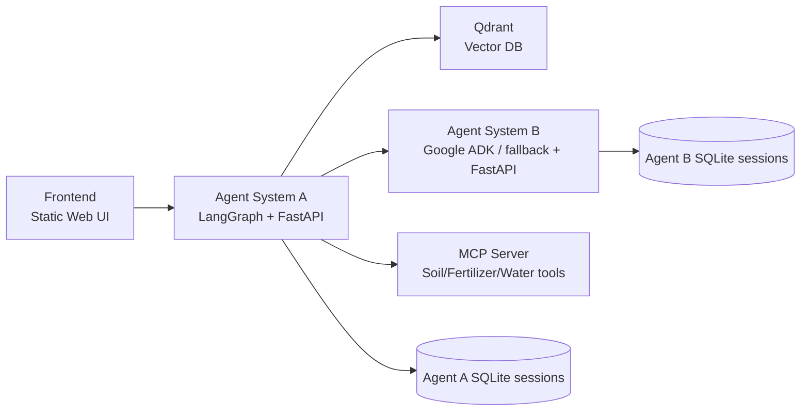

# Smart Agri Copilot

Production-style multi-agent agriculture advisor built for the Gen AI Track final project in Inmind.ai by Joud Senan.

The system focuses on Mediterranean / Lebanon-relevant crop questions such as crop management, irrigation planning, pest reasoning, soil interpretation, fertilizer direction, and harvest-versus-hold market timing.

## Project Goal

This project demonstrates the full architecture required by the rubric:

- **Agent System A**: LangGraph-based supervisor with multiple specialists and tools.
- **Agent System B**: independent FastAPI microservice with Google ADK support plus deterministic fallback.
- **RAG**: document ingestion, chunking, embeddings, Qdrant, retrieval, reranking, and metadata filtering.
- **MCP Server**: its own container exposing agriculture tools.
- **Dockerized microservices**: each service in its own container and orchestrated with `docker-compose`.
- **API layer**: FastAPI APIs, streaming on Agent A, session persistence, timeouts, and graceful fallback behavior.
- **Evaluation**: 20-question test set, retrieval metrics, generation evaluation script, and configuration comparison script.

## Architecture Diagram



## Agent System A

Agent A is the primary business workflow. It contains:

- **Supervisor**: routes the question to the right specialists.
- **Crop specialist**: retrieves crop guidance from the RAG corpus.
- **Pest specialist**: retrieves symptom and IPM guidance.
- **Market specialist**: retrieves price-trend and harvest/hold guidance.
- **Irrigation bridge**: calls Agent System B over HTTP.
- **Soil bridge**: calls the MCP server through the MCP SDK transport, with REST fallback.
- **Synthesizer**: builds the final grounded answer and applies output guardrails.

## Agent System B

Agent B is intentionally separate from Agent A and runs in a different container. It is responsible for irrigation and weather-style planning.

Primary mode:
- **Google ADK runner** when `google-adk` and a working model/API key are available.

Fallback mode:
- deterministic irrigation/frost/spray planning so the project still runs reliably.

This means the service stays online even if the LLM path is unavailable, while still showing a real second framework path in code.

## RAG Design Choices

### Corpus
The `data/` folder contains agriculture documents across crops, pests, market timing, and soil/fertilizer topics. The corpus comfortably exceeds the 15-page requirement once indexed text is considered across all files.

### Chunking
Default chunking is:
- `chunk_size = 900`
- `chunk_overlap = 180`
- separators: heading-aware recursive split (`##`, `#`, paragraph, line, sentence, token fallback)

Why this choice:
- the documents are short structured guides rather than long narrative PDFs
- preserving heading blocks improves retrieval precision for “critical stage”, “soil requirements”, and “management direction” style questions
- moderate overlap protects boundary facts like pH ranges and irrigation-sensitive stages

### Embeddings
Default embedding provider is `local_deterministic`.

Why:
- reproducible in offline environments
- avoids external dependencies 
- still supports evaluation and config comparison

The design remains extensible to stronger embedding backends later by switching env vars.

### Retrieval and reranking
- Qdrant stores the vectors.
- metadata filtering is used for crop/topic-aware retrieval.
- a lightweight hybrid rerank combines semantic score with lexical coverage.

## MCP Design

The MCP server runs in its own container and exposes these domain tools:

- `mcp_analyze_soil`
- `mcp_calculate_fertilizer`
- `mcp_estimate_water_usage`
- `mcp_analyze_bundle`

Agent A now connects to it through the **MCP Streamable HTTP** transport first, then falls back to the REST bridge if the MCP SDK bootstrap fails.

## Guardrails and Production Behaviors

Implemented guardrails and robustness features:

- input scope filtering on Agent A
- output disclaimer enforcement
- max specialist step limits
- service timeouts and retry logic
- graceful degradation if Agent B or MCP path is unavailable
- persistent chat history in SQLite for Agent A and Agent B

## Docker and Network Layout

Two Docker networks are used:

- `public-net`: frontend and Agent A only
- `internal-net`: Agent A, Agent B, MCP, and Qdrant

Only the frontend and Agent A are exposed to the host. This better matches a production microservice layout where internal services are private.

## Setup

### 1. Prepare environment
Copy the example file:

```bash
cp .env.example .env
```

On Windows PowerShell:

```powershell
Copy-Item .env.example .env
```

### 2. Start the stack

```bash
docker compose up --build -d
```

### 3. Ingest the corpus

```bash
docker compose exec agent-system-a python /app/scripts/ingest_to_qdrant.py
```

### 4. Open the UI

Open:

```text
http://localhost:3000
```

## Health Checks

Public checks:

- Agent A: `http://localhost:8101/health`
- Frontend: `http://localhost:3000`

Internal checks from Docker:

```bash
docker compose exec agent-system-b python -c "import urllib.request; print(urllib.request.urlopen('http://localhost:8102/health').read().decode())"
docker compose exec mcp-server python -c "import urllib.request; print(urllib.request.urlopen('http://localhost:8103/health').read().decode())"
docker compose exec vector-db python -c "import urllib.request; print(urllib.request.urlopen('http://localhost:6333/collections').read().decode())"
```

## Evaluation Commands

### Retrieval metrics

```bash
docker compose exec agent-system-a python /app/scripts/evaluate_retrieval.py
```

### Generation evaluation

```bash
docker compose exec agent-system-a python /app/scripts/evaluate_generation.py
```

### Compare 2 configurations

```bash
docker compose exec agent-system-a python /app/scripts/compare_configs.py
```

## Demo Query Examples

- “My tomatoes in Bekaa are flowering. How sensitive are they to water stress?”
- “Tomato leaves have white powdery patches. What should I check first?”
- “My soil pH is 8.1. What does that imply?”
- “Should I harvest now or hold if the crop is highly perishable and storage is weak?”
- “For olives, when is irrigation especially important for yield?”

## Known Limitations

- ADK execution depends on a working model/API key if you want the full Agent B LLM path.
- The packaged generation evaluation uses a heuristic fallback by default; you can wire in a judge model.

## Security

- real `.env` is intentionally excluded from the corrected package
- use `.env.example`
- session databases and runtime artifacts are gitignored
